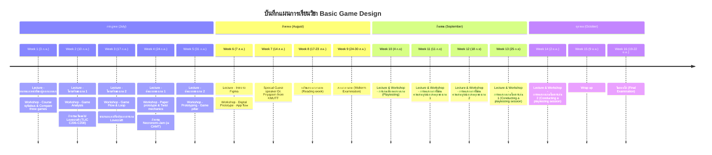

CSV

Basic Game Design sec001 - Sec001

ทำ mermaid.md ตามข้อมูล.csv หน่อย

### 1\. แบบ Flowchart (แสดงลำดับรายสัปดาห์)

```mermaid
graph TD
    %% Styles
    classDef lecture fill:#e1f5fe,stroke:#039be5,stroke-width:2px;
    classDef exam fill:#ffe0b2,stroke:#fb8c00,stroke-width:2px;
  
    W1["<strong>Week 1 (3 ก.ค.)</strong><br>• Lecture: บทบาทและหน้าที่ของผู้ออกแบบเกม<br>• Workshop: Course syllabus & Compare three games"]
    W2["<strong>Week 2 (10 ก.ค.)</strong><br>• Lecture: โครงสร้างของเกม 1 (Formal Dynamic & Dramatic)<br>• Workshop: Game Analysis<br>• Activity: เวิร์คชอร์ป Lovecraft (ห้อง TLIC C206-C208)"]
    W3["<strong>Week 3 (17 ก.ค.)</strong><br>• Lecture: โครงสร้างของเกม 2 (Game Flow & Loop)<br>• Workshop: Game Analysis: Game Flow and Game Loop<br>• Activity: นำเสนอและปรับปรุงเอกสารเกม Lovecraft"]
    W4["<strong>Week 4 (24 ก.ค.)</strong><br>• Lecture: ต้นแบบของเกม 1 (Prototyping)<br>• Workshop: Paper prototype & Twist mechanics<br>• Activity: กิจกรรม Necronomi-Jam (ณ CAMT)"]
    W5["<strong>Week 5 (31 ก.ค.)</strong><br>• Lecture: ต้นแบบของเกม 2 (Prototyping)<br>• Workshop: Game pillar > twist mechanics"]
    W6["<strong>Week 6 (7 ส.ค.)</strong><br>• Lecture: ต้นแบบของเกม 2 (Intro to Figma)<br>• Workshop: Digital Prototype: App flow"]
    W7["<strong>Week 7 (14 ส.ค.)</strong><br>• Lecture: Special Guest speaker Dr. Priyaporn from KMUTT"]
    W8["<strong>Week 8 (17-23 ส.ค.)</strong><br>• เตรียมสอบกลางภาค (Reading week)"]
    W9["<strong>Week 9 (24-30 ส.ค.)</strong><br>• สอบกลางภาค (Midterm Examination)"]
    W10["<strong>Week 10 (4 ก.ย.)</strong><br>• Lecture & Workshop: การเล่นเพื่อทดสอบเกม (Playtesting)"]
    W11["<strong>Week 11 (11 ก.ย.)</strong><br>• Lecture & Workshop: การทดสอบการใช้งาน ความสมบูรณ์และสมดุลของเกม 1"]
    W12["<strong>Week 12 (18 ก.ย.)</strong><br>• Lecture & Workshop: การทดสอบการใช้งาน ความสมบูรณ์และสมดุลของเกม 2"]
    W13["<strong>Week 13 (25 ก.ย.)</strong><br>• Lecture & Workshop: การทดสอบเกมโดยการเล่น 1 (Playtesting session)"]
    W14["<strong>Week 14 (2 ต.ค.)</strong><br>• Lecture & Workshop: การทดสอบเกมโดยการเล่น 2 (Playtesting session)"]
    W15["<strong>Week 15 (9 ต.ค.)</strong><br>• Wrap up"]
    W16["<strong>Week 16 (19-22 ต.ค.)</strong><br>• วันสอบไล่ (Final Examination)"]

    W1 --> W2 --> W3 --> W4 --> W5 --> W6 --> W7 --> W8 --> W9 --> W10 --> W11 --> W12 --> W13 --> W14 --> W15 --> W16

    class W1,W2,W3,W4,W5,W6,W7,W10,W11,W12,W13,W14,W15 lecture;
    class W8,W9,W16 exam;
```

### 2\. แบบ Timeline (แยกตามเดือน)

```mermaid
timeline 
    title บันทึกแผนการเรียนวิชา Basic Game Design
    section กรกฎาคม (July)
        Week 1 (3 ก.ค.) : Lecture - บทบาทและหน้าที่ของผู้ออกแบบเกม : Workshop - Course syllabus & Compare three games
        Week 2 (10 ก.ค.) : Lecture - โครงสร้างของเกม 1 : Workshop - Game Analysis : กิจกรรมเวิร์คชอร์ป Lovecraft (TLIC C206-C208)
        Week 3 (17 ก.ค.) : Lecture - โครงสร้างของเกม 2 : Workshop - Game Flow & Loop : นำเสนอและปรับปรุงเอกสารเกม Lovecraft
        Week 4 (24 ก.ค.) : Lecture - ต้นแบบของเกม 1 : Workshop - Paper prototype & Twist mechanics : กิจกรรม Necronomi-Jam (ณ CAMT)
        Week 5 (31 ก.ค.) : Lecture - ต้นแบบของเกม 2 : Workshop - Prototyping - Game pillar
    section สิงหาคม (August)
        Week 6 (7 ส.ค.) : Lecture - Intro to Figma : Workshop - Digital Prototype - App flow
        Week 7 (14 ส.ค.) : Special Guest speaker Dr. Priyaporn from KMUTT
        Week 8 (17-23 ส.ค.) : เตรียมสอบกลางภาค (Reading week)
        Week 9 (24-30 ส.ค.) : สอบกลางภาค (Midterm Examination)
    section กันยายน (September)
        Week 10 (4 ก.ย.) : Lecture & Workshop - การเล่นเพื่อทดสอบเกม (Playtesting)
        Week 11 (11 ก.ย.) : Lecture & Workshop - การทดสอบการใช้งาน ความสมบูรณ์และสมดุลของเกม 1
        Week 12 (18 ก.ย.) : Lecture & Workshop - การทดสอบการใช้งาน ความสมบูรณ์และสมดุลของเกม 2
        Week 13 (25 ก.ย.) : Lecture & Workshop - การทดสอบเกมโดยการเล่น 1 (Conducting a playtesting session)
    section ตุลาคม (October)
        Week 14 (2 ต.ค.) : Lecture & Workshop - การทดสอบเกมโดยการเล่น 2 (Conducting a playtesting session)
        Week 15 (9 ต.ค.) : Wrap up
        Week 16 (19-22 ต.ค.) : วันสอบไล่ (Final Examination)
```
