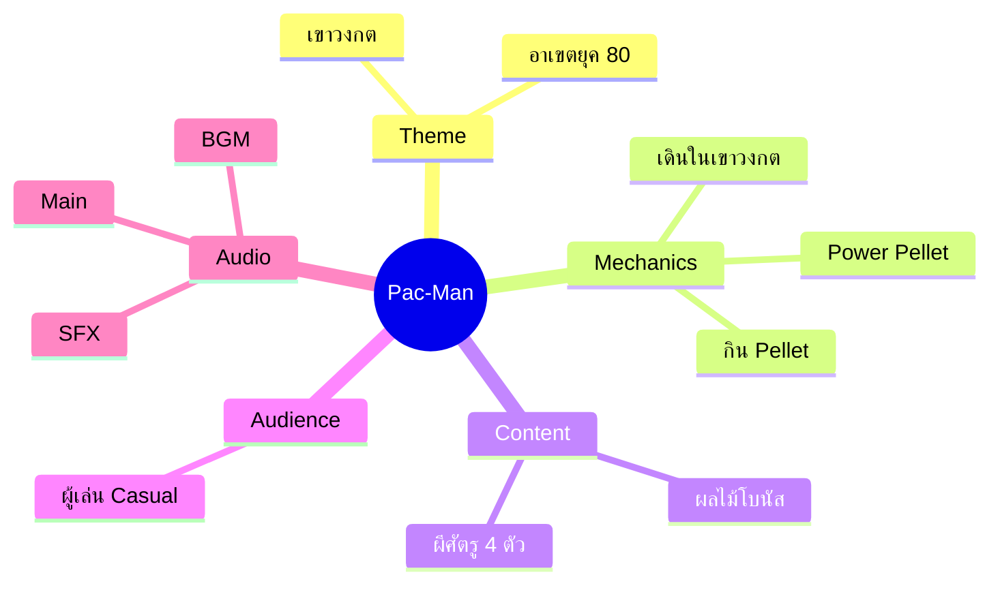
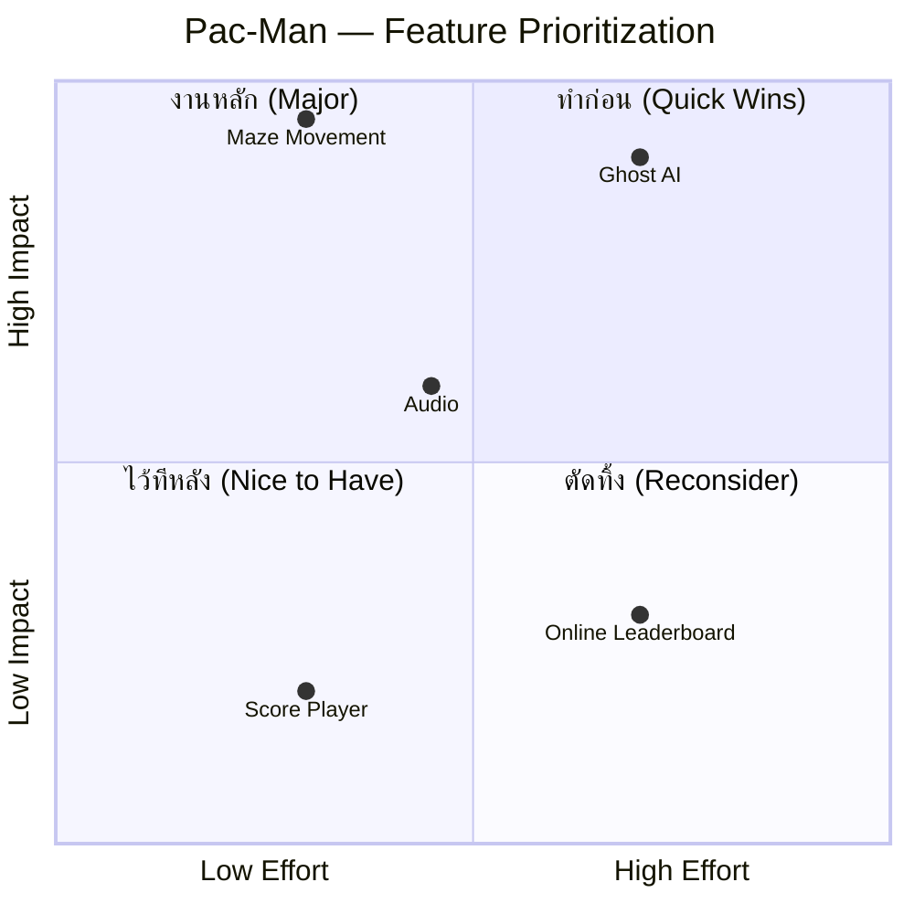
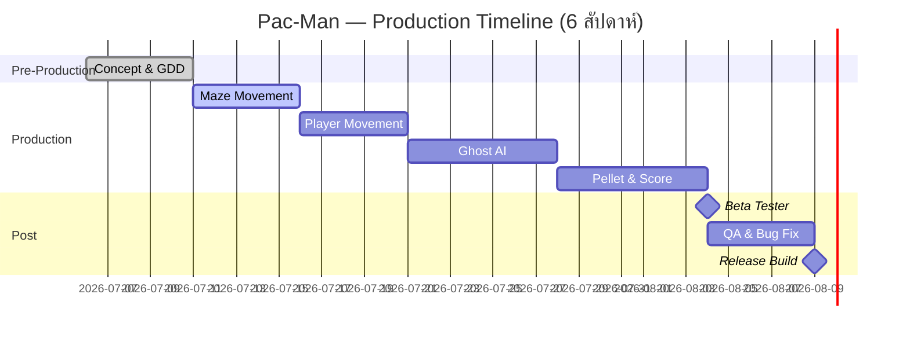

```mermaid
mindmap
  root ((Pac-Man))
    Theme
      เขาวงกต
      อาเขตยุค 80
    Mechanics
      เดินในเขาวงกต
      กิน Pellet
      Power Pellet
    Content
      ผีศัตรู 4 ตัว
      ผลไม้โบนัส
    Audience
      ผู้เล่น Casual
    Audio
      BGM
      SFX
      Main
```

```mermaid
quadrantChart
    title Pac-Man — Feature Prioritization
    x-axis "Low Effort" --> "High Effort"
    y-axis "Low Impact" --> "High Impact"
    quadrant-1 "ทำก่อน (Quick Wins)"
    quadrant-2 "งานหลัก (Major)"
    quadrant-3 "ไว้ทีหลัง (Nice to Have)"
    quadrant-4 "ตัดทิ้ง (Reconsider)"
  
    "Maze Movement": [0.3, 0.95]
    "Ghost AI": [0.7, 0.9]
    "Online Leaderboard": [0.7, 0.3]
    "Audio": [0.45, 0.6]
    "Score Player": [0.3,0.2]
    %% "PowerUp System": [0.7,0.65]
    %% "Player Movement": [0.8,0.8]
```

```mermaid
gantt 
title Pac-Man — Production Timeline (6 สัปดาห์) 
dateFormat YYYY-MM-DD 
section Pre-Production 
Concept & GDD       :done,    c1, 2026-07-06, 5d 
section Production 
Maze Movement       :active,  p1, after c1, 5d 
Player Movement     :         p2, after p1, 5d
Ghost AI            :         p3, after p2, 7d 
Pellet & Score      :         p4, after p3, 7d 
section Post 
Beta Tester         :milestone, m1, after p4, 0d
QA & Bug Fix        :         q1, after m1, 5d  
Release Build       :milestone, m2, after q1, 0d 
```
